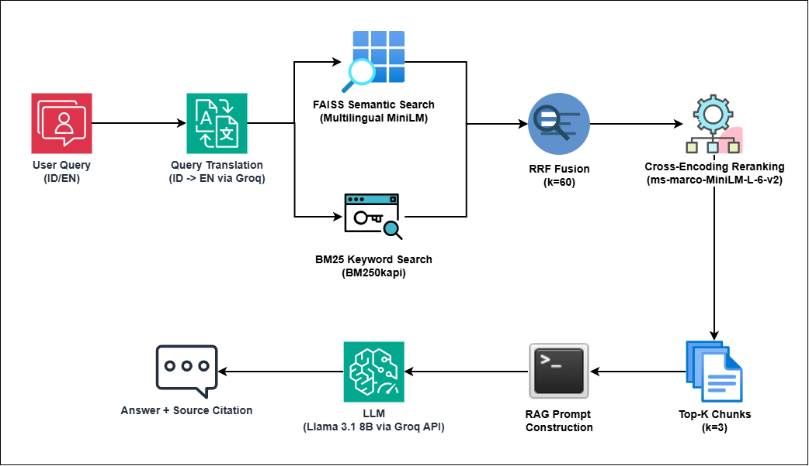
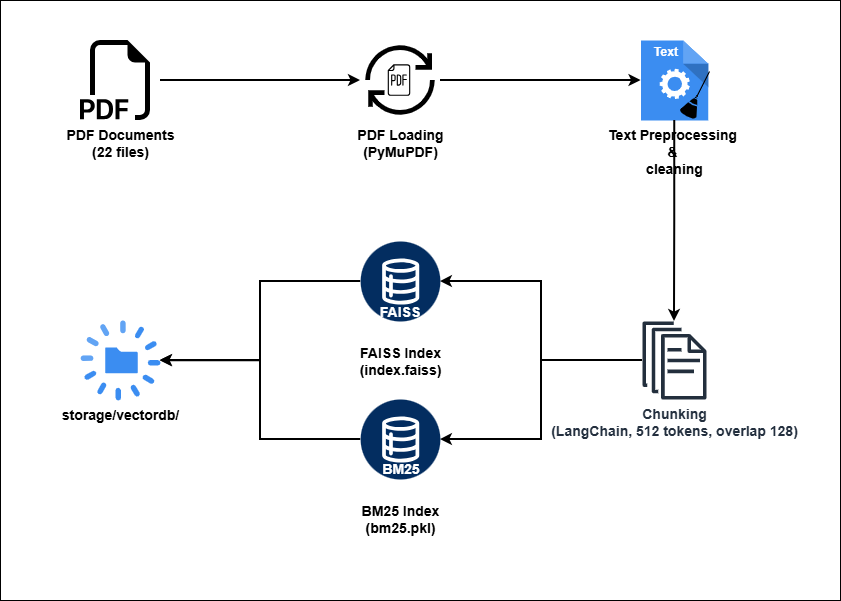

# NutriGuide — RAG-Based Pediatric Nutrition Assistant

> Evidence-based pediatric nutrition guidance powered by Retrieval-Augmented Generation (RAG), grounded in official medical documents from WHO, UNICEF, Kemenkes RI, and Buku KIA.


---

## Table of Contents

- [Overview](#overview)
- [Problem Statement](#problem-statement)
- [Features](#features)
- [Architecture](#architecture)
- [Tech Stack](#tech-stack)
- [Project Structure](#project-structure)
- [Getting Started](#getting-started)
- [API Reference](#api-reference)
- [Evaluation](#evaluation)
- [Knowledge Base](#knowledge-base)
- [Limitations](#limitations)
- [Roadmap](#roadmap)
- [Author](#author)

---

## Overview

NutriGuide is a production-grade RAG (Retrieval-Augmented Generation) application that provides evidence-based answers to questions about pediatric nutrition. Unlike generic chatbots that may hallucinate medical information, NutriGuide grounds every answer in a curated knowledge base of 22 official documents from trusted health institutions.

Every answer is accompanied by source citations, allowing users to trace back to the exact document and page that informed the response.

**Live Demo:** [Coming soon — HuggingFace Spaces]  
**Portfolio:** [syahrulgunawanramdhani-portfolio.web.app/](https://syahrulgunawanramdhani-portfolio.web.app/)

---

## Problem Statement

Parents, caregivers, and healthcare workers in Indonesia often struggle to access reliable, evidence-based pediatric nutrition information. Common issues include:

- **Misinformation** — generic search results mix credible sources with unreliable content
- **Language barrier** — most authoritative guidelines (WHO, UNICEF) are in English, while caregivers may only speak Indonesian
- **Accessibility** — official documents are long PDFs that require medical expertise to navigate
- **Hallucination risk** — general-purpose LLMs can generate plausible but incorrect medical information

NutriGuide addresses these problems by combining hybrid retrieval over official documents with an LLM that generates grounded, cited answers in the user's language.

---

## Features

- **Hybrid Retrieval** — combines FAISS semantic search with BM25 keyword search, fused via Reciprocal Rank Fusion (RRF) for superior retrieval coverage
- **Cross-Encoder Reranking** — reranks retrieved candidates using a cross-encoder model for precision before generation
- **Query Translation** — automatically detects Indonesian queries and translates them to English before retrieval, enabling cross-lingual search across all 22 documents
- **Source Citations** — every answer references its source documents with page numbers, fully transparent and traceable
- **Multilingual Support** — ask in Indonesian or English, get answers in the same language
- **RAGAS Evaluation** — pipeline quality measured using Faithfulness, Answer Relevancy, and Context Precision metrics
- **LLM Fallback** — Groq API as primary LLM with Ollama local as fallback when API is unavailable
- **Responsive UI** — clean dark-themed React frontend with typing animation, citation cards, and mobile support

---

## Architecture



### Indexing Pipeline (Offline)



---

## Tech Stack

| Layer | Technology |
|-------|-----------|
| **Backend** | FastAPI, Python 3.10, Pydantic v2 |
| **LLM** | Groq API (Llama 3.1 8B Instant) |
| **Embeddings** | sentence-transformers/paraphrase-multilingual-MiniLM-L12-v2 |
| **Vector Store** | FAISS (IndexFlatIP) |
| **Keyword Search** | BM25Okapi (rank-bm25) |
| **Retrieval Fusion** | Reciprocal Rank Fusion (RRF, k=60) |
| **Reranker** | cross-encoder/ms-marco-MiniLM-L-6-v2 |
| **PDF Processing** | PyMuPDF (fitz) |
| **Orchestration** | LangChain |
| **Evaluation** | RAGAS (Faithfulness, Answer Relevancy, Context Precision) |
| **Frontend** | React 18, Vite, Tailwind CSS v4 |
| **LLM Fallback** | Ollama (local) |

---

## Project Structure

```
nutriguide-rag/
├── backend/
│   ├── run.bat                    ← start server (Windows)
│   ├── pytest.ini
│   ├── .env.example
│   ├── scripts/
│   │   └── build_index.py         ← run once to index PDFs
│   ├── src/
│   │   ├── main.py                ← FastAPI app entry point
│   │   ├── api/
│   │   │   ├── routes/
│   │   │   │   ├── chat.py
│   │   │   │   └── health.py
│   │   │   └── middleware/
│   │   │       └── cors.py
│   │   ├── config/
│   │   │   ├── constants.py
│   │   │   └── settings.py
│   │   └── core/
│   │       ├── services/
│   │       │   ├── processing/    ← pdf_loader, preprocessor, chunker
│   │       │   ├── rag/           ← embedder, vector_store, bm25, hybrid, reranker, indexer, query_translator
│   │       │   ├── llm/           ← base_llm, groq_client, local_llm, model_factory
│   │       │   ├── inference/     ← inference_engine, response_parser
│   │       │   └── evaluation/    ← metrics, ragas_pipeline, report_generator
│   │       └── prompts/           ← templates, chain
│   ├── storage/
│   │   ├── raw/                   ← place PDF files here
│   │   └── vectordb/              ← generated index files
│   ├── notebooks/
│   │   ├── 01_data_exploration.ipynb
│   │   ├── 02_retrieval_experiment.ipynb
│   │   └── 03_evaluation_analysis.ipynb
│   └── tests/
│       ├── unit/
│       └── integration/
└── frontend/
    ├── src/
    │   ├── components/
    │   │   ├── chat/              ← ChatBox, MessageBubble, CitationCard
    │   │   ├── layout/            ← Navbar
    │   │   └── ui/                ← LoadingDots
    │   ├── hooks/
    │   │   └── useChat.js
    │   ├── pages/                 ← Landing, Chat, About
    │   └── utils/
    │       └── api.js
    └── public/
        └── architecture.png
```

---

## Getting Started

### Prerequisites

- Python 3.10+
- Node.js 22+
- Conda (recommended)
- Groq API key — free at [console.groq.com](https://console.groq.com)

### 1. Clone the repository

```bash
git clone https://github.com/syagura/nutriguide-rag.git
cd nutriguide-rag
```

### 2. Setup backend environment

```bash
cd backend
conda create -n nutriguide python=3.10 -y
conda activate nutriguide
pip install -r requirements.txt
```

### 3. Configure environment variables

```bash
cp .env.example .env
```

Edit `.env`:

```env
GROQ_API_KEY=your_groq_api_key_here
OLLAMA_BASE_URL=http://localhost:11434
```

### 4. Add knowledge base PDFs

Place your PDF files in `backend/storage/raw/`. Recommended sources:

- WHO Child Growth Standards
- WHO Guideline for Complementary Feeding (2023)
- Pedoman Gizi Seimbang — Kemenkes RI (2014)
- Angka Kecukupan Gizi (AKG) — Permenkes No. 28 Tahun 2019
- Buku KIA — Kemenkes RI
- MTBS — Kemenkes RI
- Stranas Percepatan Pencegahan Stunting — Bappenas

### 5. Build the index

```bash
# From backend/ folder
set PYTHONPATH=src        # Windows
export PYTHONPATH=src     # Linux/Mac
python scripts/build_index.py
```

This will process all PDFs and generate FAISS + BM25 indexes in `storage/vectordb/`.

### 6. Start the backend

```bash
# Windows — just run:
run.bat

# Or manually:
set PYTHONPATH=src
uvicorn main:app --reload
```

Backend runs at `http://localhost:8000`

### 7. Setup and start the frontend

```bash
cd frontend
npm install
npm run dev
```

Frontend runs at `http://localhost:5173`

---

## API Reference

### POST `/api/v1/chat`

Send a question and receive a grounded answer with source citations.

**Request:**
```json
{
  "query": "When should I start MPASI?",
  "top_k": 3
}
```

**Response:**
```json
{
  "answer": "Complementary feeding (MPASI) should be introduced at 6 months...",
  "sources": [
    {
      "source": "WHO Guideline for complementary feeding.pdf",
      "page": 12,
      "text": "..."
    }
  ],
  "has_sources": true,
  "processing_time": 2.34,
  "query": "When should I start MPASI?"
}
```

### GET `/api/v1/health`

Check API and pipeline status.

**Response:**
```json
{
  "status": "healthy",
  "pipeline_loaded": true,
  "model": "llama-3.1-8b-instant"
}
```

---

## Evaluation

NutriGuide is evaluated using [RAGAS](https://docs.ragas.io/) on three metrics:

| Metric | Score | Description |
|--------|-------|-------------|
| **Faithfulness** | 1.0 | Answers are fully grounded in retrieved documents — no hallucination |
| **Answer Relevancy** | — | Measures how relevant the answer is to the question |
| **Context Precision** | 0.33 | Proportion of retrieved chunks that are relevant |

> Evaluation was run on a small sample (1-5 test cases) using Ollama as the evaluator LLM due to Groq free tier rate limits. Scores are indicative and not exhaustive.

**Faithfulness = 1.0** is the most critical metric for a medical information system — it confirms the LLM is not hallucinating information outside of the retrieved documents.

---

## Knowledge Base

NutriGuide uses 22 official documents across 4 trusted institutions:

| Institution | Coverage |
|-------------|----------|
| **WHO** — World Health Organization | Child growth standards, complementary feeding, IMCI, stunting prevention, anthropometry |
| **UNICEF** — Child Nutrition Division | Malnutrition reports, complementary feeding guidance, parenting guides, ECD |
| **Kemenkes RI** — Ministry of Health | Pedoman Gizi Seimbang, AKG 2019, MTBS, SDIDTK, Buku KIA |
| **Bappenas** | Strategi Nasional Percepatan Pencegahan Stunting 2018-2024 |

---

## Limitations

- **Table extraction** — PDF tables (e.g., WHO growth charts with numeric data) are not extracted perfectly by PyMuPDF. Queries about specific numeric thresholds may return incomplete context.
- **Groq rate limits** — Free tier is limited to 30 requests/minute and 6,000 tokens/minute. Heavy usage may result in temporary slowdowns.
- **Small evaluator model** — RAGAS evaluation uses Ollama qwen2.5:0.5b locally due to RAM constraints, which may affect evaluation score accuracy.
- **Context window** — Only top-3 chunks are passed to the LLM. Complex questions requiring synthesis across many document sections may get incomplete answers.
- **Not a medical professional** — NutriGuide provides information from official documents but is not a substitute for professional medical advice.

---

## Roadmap

- [ ] Deploy to HuggingFace Spaces
- [ ] Improve table extraction for numeric WHO growth data
- [ ] Add streaming response support
- [ ] Expand knowledge base with more Kemenkes documents
- [ ] Add conversation history / multi-turn support
- [ ] Improve context precision with better chunking strategy

---

## Author

**Syahrul Gunawan Ramdhani**  
AI/ML Engineer · Data Scientist  

[](https://linkedin.com/in/syahrulgunawanramdhani)
[](https://github.com/syagura)
[](mailto:syahrulgunawanramdhani@gmail.com)

---

## License

This project is licensed under the [MIT License](LICENSE). Knowledge base documents remain property of their respective institutions (WHO, UNICEF, Kemenkes RI, Bappenas).