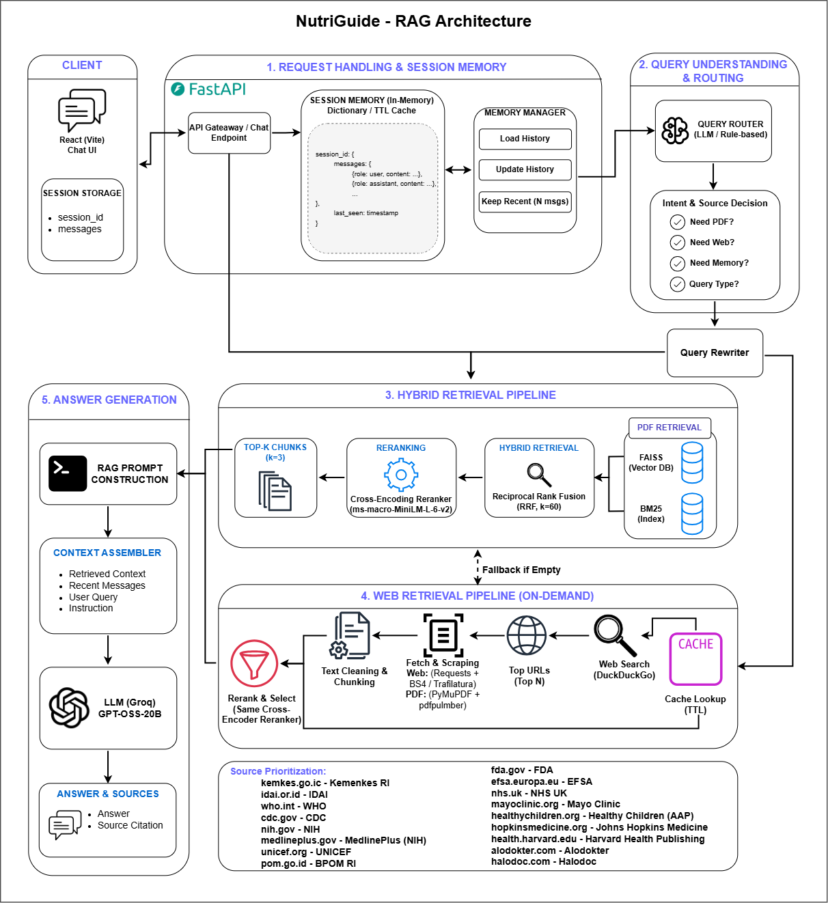
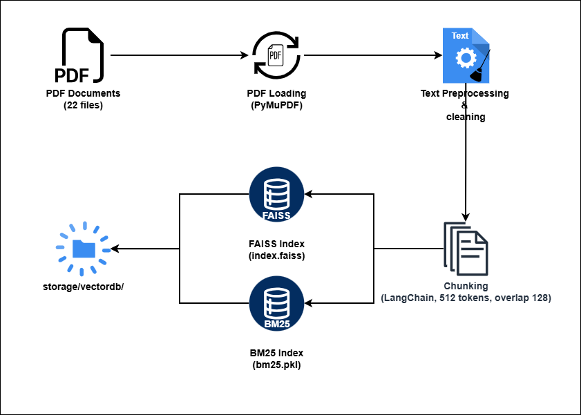

# NutriGuide — RAG-Based Pediatric Nutrition Assistant

> Evidence-based pediatric nutrition guidance powered by Retrieval-Augmented Generation (RAG), grounded in official medical documents from WHO, UNICEF, Kemenkes RI, and Buku KIA.


---

## Table of Contents

- [NutriGuide — RAG-Based Pediatric Nutrition Assistant](#nutriguide--rag-based-pediatric-nutrition-assistant)
  - [Table of Contents](#table-of-contents)
  - [Overview](#overview)
  - [Problem Statement](#problem-statement)
  - [Features](#features)
  - [Architecture](#architecture)
    - [Indexing Pipeline (Offline)](#indexing-pipeline-offline)
  - [Tech Stack](#tech-stack)
  - [Project Structure](#project-structure)
  - [Getting Started](#getting-started)
    - [Prerequisites](#prerequisites)
    - [1. Clone the repository](#1-clone-the-repository)
    - [2. Setup backend environment](#2-setup-backend-environment)
    - [3. Configure environment variables](#3-configure-environment-variables)
    - [4. Add knowledge base PDFs](#4-add-knowledge-base-pdfs)
    - [5. Build the index](#5-build-the-index)
    - [6. Start the backend](#6-start-the-backend)
    - [7. Setup and start the frontend](#7-setup-and-start-the-frontend)
  - [API Reference](#api-reference)
    - [POST `/api/v1/chat`](#post-apiv1chat)
    - [GET `/api/v1/health`](#get-apiv1health)
  - [Evaluation](#evaluation)
  - [Knowledge Base](#knowledge-base)
  - [Limitations](#limitations)
  - [Roadmap](#roadmap)
  - [Author](#author)
  - [License](#license)

---

## Overview

NutriGuide is a production-grade RAG (Retrieval-Augmented Generation) application that provides evidence-based answers to questions about pediatric nutrition. Unlike generic chatbots that may hallucinate medical information, NutriGuide grounds every answer in a curated knowledge base of 22 official documents from trusted health institutions.

**Update (V2):** NutriGuide has envolved from a single-source PDF RAG system into a conversational, multi-source assistant - with session memory, hybrid query routing, live web retrieval restricted to vetted health authorities, and comparative RAGAS evaluation across retrieval strategies.

Every answer is accompanied by source citations, allowing users to trace back to the exact document and page that informed the response.

**Live Demo:** [nutriguide-rag.vercel.app](https://nutriguide-rag.vercel.app/)  
**Portfolio:** [syahrulgunawanramdhani-portfolio.web.app](https://syahrulgunawanramdhani-portfolio.web.app/)

---

## Problem Statement

Parents, caregivers, and healthcare workers in Indonesia often struggle to access reliable, evidence-based pediatric nutrition information. Common issues include:

- **Misinformation** — generic search results mix credible sources with unreliable content
- **Language barrier** — most authoritative guidelines (WHO, UNICEF) are in English, while caregivers may only speak Indonesian
- **Accessibility** — official documents are long PDFs that require medical expertise to navigate
- **Hallucination risk** — general-purpose LLMs can generate plausible but incorrect medical information

NutriGuide addresses these problems by combining hybrid retrieval over official documents with an LLM that generates grounded, cited answers in the user's language.

---

## Features

- **Hybrid Retrieval** — combines FAISS semantic search with BM25 keyword search, fused via Reciprocal Rank Fusion (RRF) for superior retrieval coverage
- **Cross-Encoder Reranking** — reranks retrieved candidates using a cross-encoder model for precision before generation
- **Query Translation** — automatically detects Indonesian queries and translates them to English before retrieval, enabling cross-lingual search across all 22 documents
- **Session-Based Conversational Memory** - in-memory, TTL-bound session store lets follow-up questions resolve againts recent conversation, without permanent chat hisrtory
- **Hybrid Query Routing** - a rule-based + LLM-fallback router decides per query whether memory, the local PDF corpus, and/or live web retrieval are needed, avoiding unnecessary retrieval calls
- **Query Rewriting** - elliptical follow-ups are reformulated into standalone queries before hitting retrieval. so context-dependent questions actually retrieve something relevant
- **Live Web Retrieval** - search results are restricted to a curated allowlist of official health authorities (WHO, CDC, NIH, Kemenkes RI, IDAI, and others), tiered by source authority, with a TTL cache to reduce repeated searches
- **Bidirectional Source Fallback** - if the local PDF corpus returns nothing, the system falls back to web retrieval, and vice versa, before giving up
- **Table-Aware PDF Extraction** - supplements PyMuPDF text extraction with pdfplumber table detection, applied to both the local corpus and PDFs discovered via web search
- **Source Citations** — every answer references its source documents (with page numbers for PDFs, clickable links for web sources), fully transparent and traceable
- **Multilingual Support** — ask in Indonesian or English, get answers in the same language, even when the underlying source is in the other language
- **Comparative RAGAS Evaluation** — pipeline quality measured across four retrieval strategies (PDF-only, Web-only, Hybrid, Memory + Retrieval) using Faithfulness, Answer Relevancy, and Context Precision metrics
- **LLM Fallback** — Groq API as primary LLM with Ollama local as fallback when API is unavailable
- **Responsive UI** — clean dark-themed React frontend with markdown-rendered answers (tables, bold, lists), clickable citations links, a staged loading indicator, and mobile support

---

## Architecture



### Indexing Pipeline (Offline)



---

## Tech Stack

| Layer | Technology |
|-------|-----------|
| **Backend** | FastAPI, Python 3.10, Pydantic v2 |
| **LLM** | Groq API (Openai/gpt-oss-20B) |
| **Embeddings** | sentence-transformers/paraphrase-multilingual-MiniLM-L12-v2 |
| **Vector Store** | FAISS (IndexFlatIP) |
| **Keyword Search** | BM25Okapi (rank-bm25) |
| **Retrieval Fusion** | Reciprocal Rank Fusion (RRF, k=60) |
| **Reranker** | cross-encoder/ms-marco-MiniLM-L-6-v2 |
| **PDF Processing** | PyMuPDF (fitz) |
| **Orchestration** | LangChain |
| **Web Search** | DuckDuckGo ('ddgs') |
| **Web Extraction** | Trafilatura + BeautifulSoup4 (HTML), PyMuPDF + pdfplumber (PDF) |
| **Session Memory** | In-memory TTL store |
| **Web Cache** | In-memory TTL cache |
| **Evaluation** | RAGAS (Faithfulness, Answer Relevancy, Context Precision) |
| **Frontend** | React 18, Vite, Tailwind CSS v4 |
| **LLM Fallback** | Ollama (local) |

---

## Project Structure

```
nutriguide-rag/
├── backend/
│   ├── run.bat                    ← start server (Windows)
│   ├── pytest.ini
│   ├── .env.example
│   ├── scripts/
│   │   └── build_index.py         ← run once to index PDFs
│   ├── src/
│   │   ├── main.py                ← FastAPI app entry point
│   │   ├── api/
│   │   │   ├── routes/
│   │   │   │   ├── chat.py
│   │   │   │   └── health.py
│   │   │   └── middleware/
│   │   │       └── cors.py
│   │   ├── config/
│   │   │   ├── constants.py
│   │   │   └── settings.py
│   │   └── core/
│   │       ├── services/
│   │       │   ├── evaluation/     ← metrics, ragas_pipeline, report_generator
│   │       │   ├── inference/      ← inference_engine, response_parser
│   │       │   ├── llm/            ← base_llm, groq_client, local_llm, model_factory
│   │       │   ├── memory/         ← session_store
│   │       │   ├── processing/     ← pdf_loader, preprocessor, chunker, pdf_tables
│   │       │   ├── router/         ← rules, llm_router, query_router
│   │       │   ├── rag/            ← embedder, vector_store, bm25, hybrid, reranker, indexer, query_translator
│   │       │   └── web/            ← search, fetcher, extractor, web_retiever, web_cache, source_priority
│   │       └── prompts/            ← templates, chain
│   ├── storage/
│   │   ├── raw/                    ← place PDF files here
│   │   └── vectordb/               ← generated index files
│   ├── notebooks/
│   │   ├── 01_data_exploration.ipynb
│   │   ├── 02_retrieval_experiment.ipynb
│   │   └── 03_evaluation_analysis.ipynb
│   └── tests/
│       ├── unit/
│       └── integration/
└── frontend/
    ├── src/
    │   ├── components/
    │   │   ├── chat/              ← ChatBox, MessageBubble, CitationCard
    │   │   ├── layout/            ← Navbar
    │   │   └── ui/                ← LoadingDots
    │   ├── hooks/
    │   │   └── useChat.js
    │   ├── pages/                 ← Landing, Chat, About
    │   └── utils/
    │       └── api.js
    └── public/
        └── architecture.png
```

---

## Getting Started

### Prerequisites

- Python 3.10+
- Node.js 22+
- Conda (recommended)
- Groq API key — free at [console.groq.com](https://console.groq.com)

### 1. Clone the repository

```bash
git clone https://github.com/syagura/nutriguide-rag.git
cd nutriguide-rag
```

### 2. Setup backend environment

```bash
cd backend
conda create -n nutriguide python=3.10 -y
conda activate nutriguide
pip install -r requirements.txt
```

### 3. Configure environment variables

```bash
cp .env.example .env
```

Edit `.env`:

```env
GROQ_API_KEY=your_groq_api_key_here
OLLAMA_BASE_URL=http://localhost:11434
```

### 4. Add knowledge base PDFs

Place your PDF files in `backend/storage/raw/`. Recommended sources:

- WHO Child Growth Standards
- WHO Guideline for Complementary Feeding (2023)
- Pedoman Gizi Seimbang — Kemenkes RI (2014)
- Angka Kecukupan Gizi (AKG) — Permenkes No. 28 Tahun 2019
- Buku KIA — Kemenkes RI
- MTBS — Kemenkes RI
- Stranas Percepatan Pencegahan Stunting — Bappenas

### 5. Build the index

```bash
# From backend/ folder
set PYTHONPATH=src        # Windows
export PYTHONPATH=src     # Linux/Mac
python scripts/build_index.py
```

This will process all PDFs and generate FAISS + BM25 indexes in `storage/vectordb/`.

### 6. Start the backend

```bash
# Windows — just run:
run.bat

# Or manually:
set PYTHONPATH=src
uvicorn main:app --reload
```

Backend runs at `http://localhost:8000`

### 7. Setup and start the frontend

```bash
cd frontend
npm install
npm run dev
```

Frontend runs at `http://localhost:5173`

---

## API Reference

### POST `/api/v1/chat`

Send a question and receive a grounded answer with source citations.

**Request:**
```json
{
  "query": "What are the iron requirements for a 6-month-old baby?",
  "session_id": null
}
```
*(`session_id` is optional - omit it to start a new session; reusethe one returned in a previous reponse to continue the conversation)*

**Response:**
```json
{
  "query": "What are the iron requirements for a 6-month-old baby?"
  "answer": "...",
  "sources": [
    { "label": "WHO Infant and Young Child Feeding.pdf — PDF, "url": null },
    { "label": "WHO — Iron Requirements in Infants", "url": "https://who.int/..." }
  ],
  "has_sources": true,
  "session_id": "7e2d660d-a3eb-48e1-a212-2f3594407dfe"
}
```

### GET `/api/v1/health`

Check API and pipeline status.

**Response:**
```json
{
  "status": "healthy",
  "pipeline_loaded": true,
  "model": "openai/gpt-oss-20b"
}
```

---

## Evaluation

NutriGuide is evaluated using [RAGAS](https://docs.ragas.io/) on three metrics:
Pipeline quality is measured with RAGAS across four retrieval strategies on the same test cases: **PDF-only**, **Web-only**, **Hybrid**, and **Memory+Retrieval** (multi-turn, with query rewriting).

| Metric | Score | Description |
|--------|-------|-------------|
| **Faithfulness** | 1.0 | Answers are fully grounded in retrieved documents — no hallucination |
| **Answer Relevancy** | — | Measures how relevant the answer is to the question |
| **Context Precision** | 0.33 | Proportion of retrieved chunks that are relevant |

> **Note:** Faithfulness evaluation requires multi-step structured reasoning from the judge LLM. Running this locally on consumer hardware (8GB RAM, `qwen2.5:1.5b` as the judge model via Ollama) occasionally results in the judge failing to produce a valid score for a given sample - these are reported as "could not be computed" rather than a misleading zero, rather than silently dropped or faked.

**Faithfulness = 1.0** is the most critical metric for a medical information system — it confirms the LLM is not hallucinating information outside of the retrieved documents.

---

## Knowledge Base

The local corpus consists of 22 official documents covering:

- **General & complementary feeding guidance** — WHO, UNICEF, and Kemenkes RI infant/young child feeding guidelines
- **Growth & stunting** — WHO child growth standards, Indonesia's national stunting prevention strategy, and joint WHO/UNICEF/World Bank malnutrition estimates
- **Illness management** — WHO IMCI and its Indonesian adaptation (MTBS), plus WHO's hospital care guidelines for children
- **Child development** — Indonesia's SDIDTK stimulation guidelines and UNICEF's early childhood development programme guidance
- **National regulation** — Kemenkes ministerial regulations on nutrient adequacy and anthropometric standards

Live web retrieval supplements this corpus with the same tier of sources (WHO, CDC, NIH, Kemenkes RI, IDAI, and other vetted health authorities) - see [Source Prioritization](#) in the architecture diagram for the full allowlist.

---

## Limitations

- **Table extraction** — PDF tables (e.g., WHO growth charts with numeric data) are not extracted perfectly by PyMuPDF. Queries about specific numeric thresholds may return incomplete context.
- **Groq rate limits** — Free tier is limited to 30 requests/minute and 6,000 tokens/minute. Heavy usage may result in temporary slowdowns.
- **Small evaluator model** — RAGAS evaluation uses Ollama qwen2.5:0.5b locally due to RAM constraints, which may affect evaluation score accuracy.
- **Context window** — Only top-3 chunks are passed to the LLM. Complex questions requiring synthesis across many document sections may get incomplete answers.
- **Not a medical professional** — NutriGuide provides information from official documents but is not a substitute for professional medical advice.
- Web retrieval respects `robots.txt`, so some official sources may be unreachable even when their domain is trusted
- Chart/graph content embedded as images (not text) is not extracted, even from local PDFs - only text and grid-style tables are captured
- Session memory and web cache are in-memory only - not persisted across backend restarts, and not shared across multiple worker processes if scaled horizontally

---

## Roadmap

- [x] Session-based conversational memory
- [x] Hybrid query routing (rule-based + LLM)
- [x] Live web retrieval with trusted-domain allowlist
- [x] Bidirectional PDF/web fallback
- [x] Web retrieval TTL cache
- [x] Table-aware PDF extraction
- [x] Comparative RAGAS evaluation
- [ ] OCR/vision-based extraction for chart and graph content
- [ ] Distributed session/cache store (Redis) for multi-worker deployments

---

## Author

**Syahrul Gunawan Ramdhani**  
AI/ML Engineer · Data Scientist  

[](https://linkedin.com/in/syahrulgunawanramdhani)
[](https://github.com/syagura)
[](mailto:syahrulgunawanramdhani@gmail.com)

---

## License

This project is licensed under the [MIT License](LICENSE). Knowledge base documents remain property of their respective institutions (WHO, UNICEF, Kemenkes RI, Bappenas).